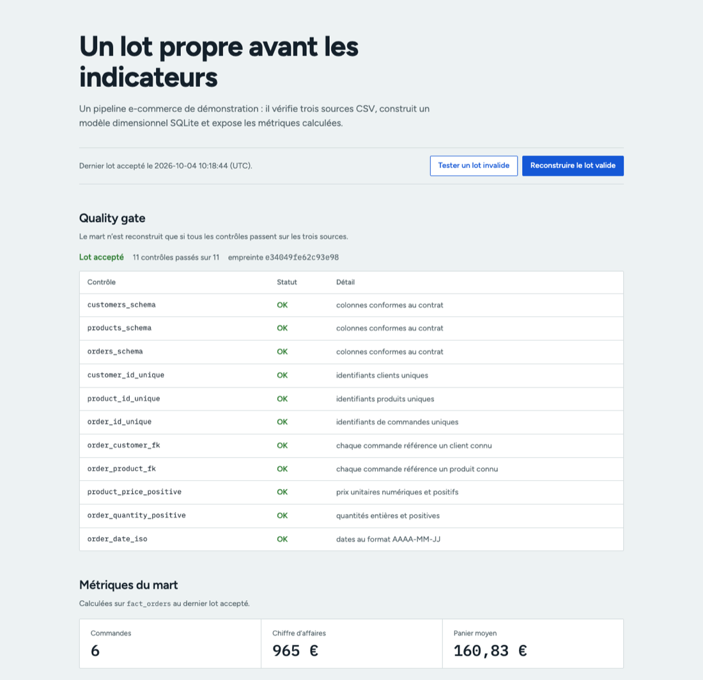

# Metric Lab

Un pipeline e-commerce de démonstration : trois fichiers sources, un quality gate, un modèle dimensionnel SQLite et des métriques inspectables.



La capture montre le quality gate du lot accepté (11 contrôles sur les trois CSV), puis les métriques calculées sur `fact_orders`. Démo : https://metric-lab-ikel.onrender.com

## Test en moins d’une minute

Lance l’application, puis ouvre `http://localhost:8000`. **Tester un lot invalide** ajoute une colonne hors contrat en mémoire, affiche le contrôle en échec et ne touche pas au mart existant. **Reconstruire le lot valide** rejoue ensuite le pipeline complet à partir des trois CSV locaux.

Le contexte Frankfurter / BCE est optionnel et séparé des métriques e-commerce. L’interface affiche la date de valeur et un lien vers la source. S’il est indisponible, le quality gate, le mart et les métriques locales continuent de fonctionner.

## Lancer

```bash
python3 src/server.py
```

Ouvrir `http://127.0.0.1:8000`. La première exécution construit la base locale à partir des CSV de démonstration.

## Ce que le projet montre

- ingestion de sources brutes ;
- modèle `fact_orders` + dimensions clients et produits ;
- table de métriques quotidiennes ;
- API légère et dashboard local ;
- tests de cohérence sur le pipeline ;
- contexte de marché optionnel avec les derniers taux EUR publiés par Frankfurter à partir de la BCE.

## Ce qui rend le pipeline utilisable

Avant toute reconstruction, Metric Lab applique un quality gate aux trois sources : schéma attendu, unicité des identifiants, références clients et produits, montants positifs et format de date. Un lot en échec est rejeté avec `422` sans remplacer le mart existant. Un lot accepté conserve une empreinte de contenu, la date d’exécution et le nombre de contrôles réalisés dans SQLite.

Les ventes et commandes du mini-entrepôt sont synthétiques et servent à tester le modèle. Le contexte de marché est distinct : `GET /api/market-context` interroge une source publique sans clé, identifiée par un en-tête applicatif, puis indique clairement si elle est indisponible.

La qualité du lot est disponible via `GET /api/quality`. `POST /api/rebuild` ne rebâtit le mart qu’après validation complète.

## Ligne de commande

```bash
python3 src/pipeline.py
python3 -m unittest discover -s tests
```

## Limites

Les commandes, clients et produits sont synthétiques (6 commandes) : les chiffres servent à tester le modèle, pas à décrire une activité réelle.
L’entrepôt est un fichier SQLite local écrit par un seul processus serveur, sans verrou applicatif entre deux reconstructions simultanées.
